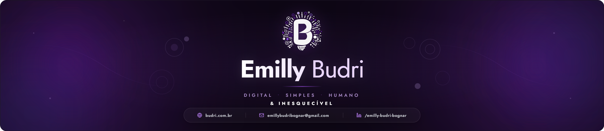

  <!-- BANNER -->
  

 

<!-- INTRO  -->

 

### Olá, eu sou **Emilly Budri Bognar** 💜  
**Eu não crio só telas — eu crio caminhos.**
  
Meu trabalho une <b>UX Design</b> e <b>Front-End</b> com um objetivo simples: fazer o digital ser leve, claro e humano.
  Gosto de construir experiências que respeitam tempo, atenção e sentimento — e que ainda entregam performance e resultado.

  
 

  
  &nbsp;&nbsp;
  

 

---

  <h2>✨ Tech Stack & Ferramentas</h2>

  

    <!-- Linguagens -->
    
    
    
    
    
  

  

    <!-- Frameworks -->
    
    
    
    
    
  

  

    <!-- Ecossistema -->
    
    
    
    
    
  

---

  <h2>📊 GitHub em ação</h2>

  <!-- STATS LADO A LADO -->
  <table>
    <tr>
      <td>
        
      </td>
      <td>
        
      </td>
    </tr>
  </table>

  

  <samp>Desenvolvido com 💜 por Emilly Budri</samp>

