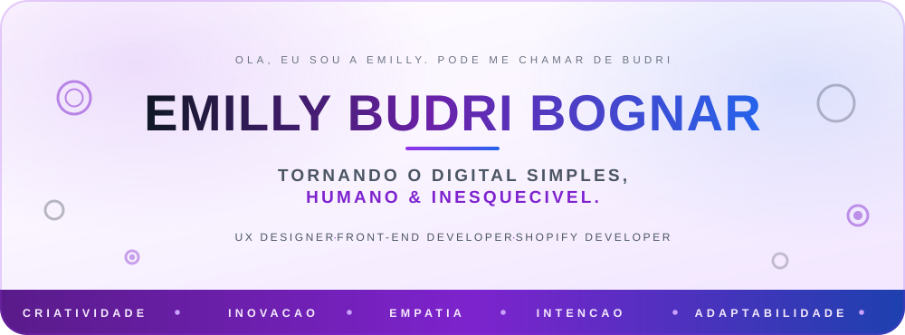
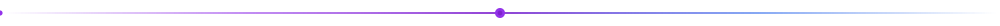
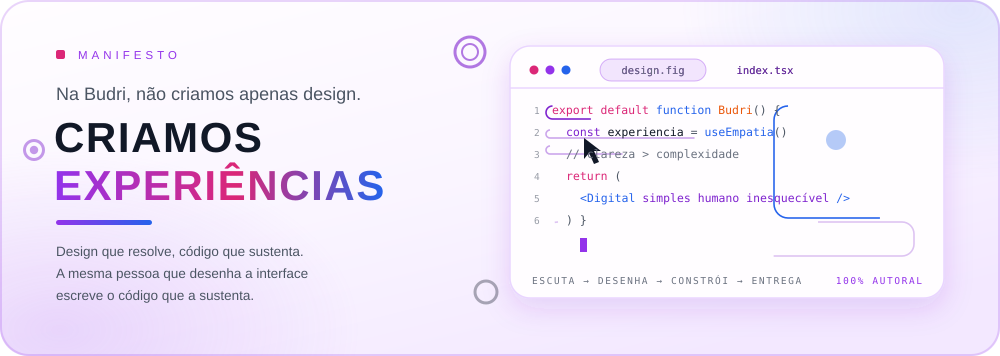
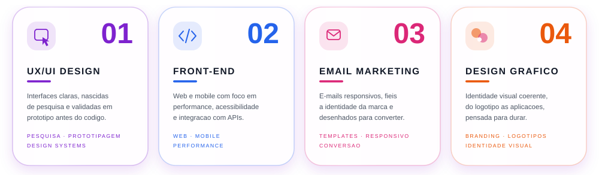
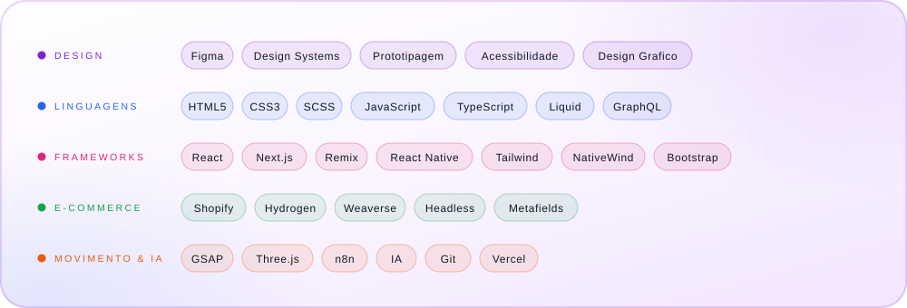
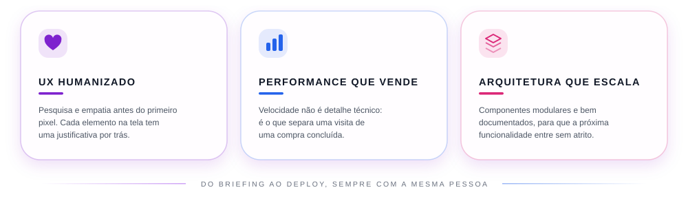
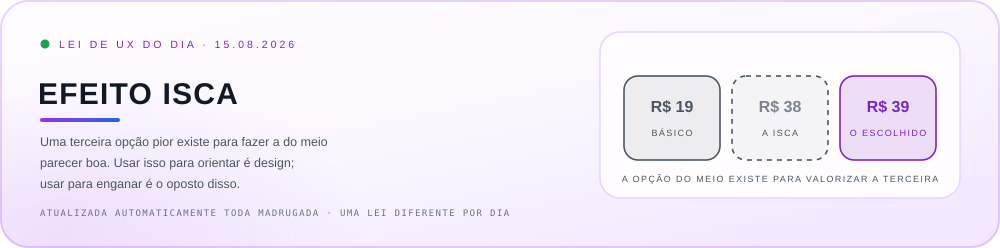
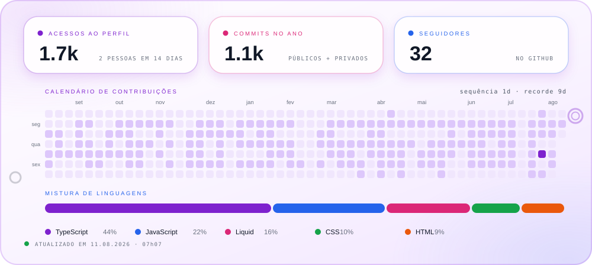
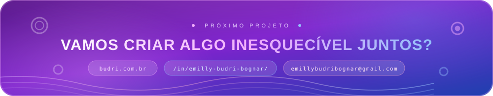

<!-- Cada peça tem dois temas: o claro (o padrão da marca) e o escuro.
     O <picture> troca junto com o tema do seu GitHub. -->

<a href="https://budri.com.br" target="_blank">
  <picture>
    <source media="(prefers-color-scheme: dark)" srcset="./assets/hero-dark.svg" />
    
  </picture>
</a>

 

<picture><source media="(prefers-color-scheme: dark)" srcset="./assets/divisor-dark.svg" /></picture>

<picture>
  <source media="(prefers-color-scheme: dark)" srcset="./assets/manifesto-dark.svg" />
  
</picture>

Eu desenho a interface e escrevo o código que a sustenta. É esse o meu trabalho.

Atuo exatamente onde o **UX design** encontra o **desenvolvimento front-end**: a pesquisa vira fluxo, o fluxo vira componente e o componente vira uma interface que a pessoa usa sem esforço. Trabalho com e-commerces que precisam converter, produtos que precisam escalar e marcas que precisam ser lembradas.

> Design não é apenas sobre como as coisas parecem. 
> É sobre **como a pessoa se sente** usando o que construímos. 💜

<picture><source media="(prefers-color-scheme: dark)" srcset="./assets/divisor-dark.svg" /></picture>

## O que eu faço?

<picture>
  <source media="(prefers-color-scheme: dark)" srcset="./assets/servicos-dark.svg" />
  
</picture>

Do briefing ao deploy, o projeto passa por uma pessoa só. Levanto os requisitos, arquiteto os fluxos, desenho a interface com todos os estados previstos (vazio, carregando, erro e sucesso) e escrevo o código que sustenta a entrega.

<picture><source media="(prefers-color-scheme: dark)" srcset="./assets/divisor-dark.svg" /></picture>

## Ferramentas

<picture>
  <source media="(prefers-color-scheme: dark)" srcset="./assets/stack-dark.svg" />
  
</picture>

<picture><source media="(prefers-color-scheme: dark)" srcset="./assets/divisor-dark.svg" /></picture>

## Por que trabalhar comigo?

<picture>
  <source media="(prefers-color-scheme: dark)" srcset="./assets/diferenciais-dark.svg" />
  
</picture>

<picture><source media="(prefers-color-scheme: dark)" srcset="./assets/divisor-dark.svg" /></picture>

## Lei de UX do dia

<picture>
  <source media="(prefers-color-scheme: dark)" srcset="./assets/leidodia-dark.svg" />
  
</picture>

<picture><source media="(prefers-color-scheme: dark)" srcset="./assets/divisor-dark.svg" /></picture>

## Minha atividade

<picture>
  <source media="(prefers-color-scheme: dark)" srcset="./assets/telemetria-dark.svg" />
  
</picture>

<a href="https://budri.com.br" target="_blank">
  <picture>
    <source media="(prefers-color-scheme: dark)" srcset="./assets/footer-dark.svg" />
    
  </picture>
</a>

